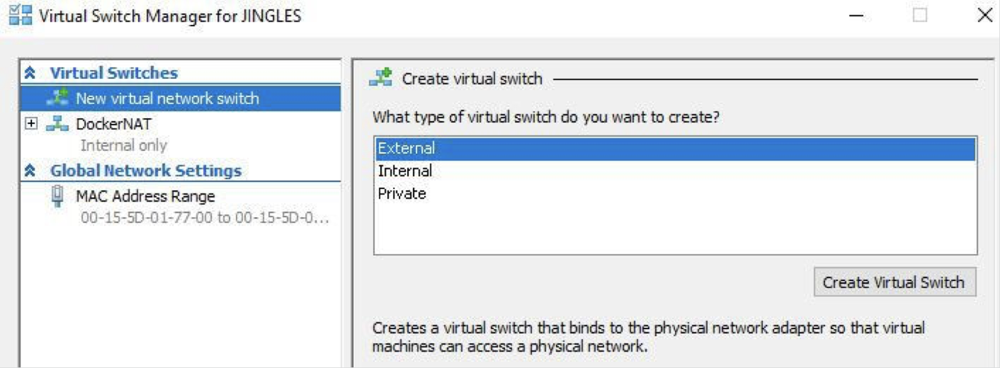
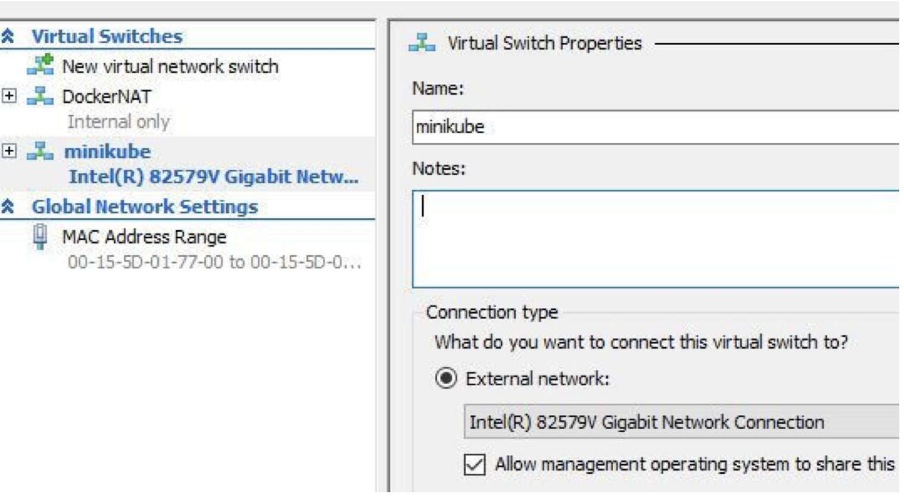

# Minikube for Windows
Minikube is an all-in-one Kubernetes cluster which runs on a local machine and can be used for developing and testing. 
The following lab will provide steps for installing Minikube on Windows

## Install a hypervisor 
Minikube requires a hypervisor and there are a couple options for Windows. 
* VirtualBox 
* Hyper-V

Hyper-V comes installed with Windows 10 and newer so it is the recommended solution. 

Open the Hyper-V manager and click on `Virtual Switch Manager`
Select `Virtual Switch Manager` from the Actions Panel and setup a new external network switch by clicking `Create Virtual Switch`


Give this new external network switch a name of `minikube`


Make sure and check "Allow management operating system to share this network adapter"

Select `Apply` and click `Okay` 

Restart your computer to apply changes. 

After computer boots back up we are going to install `kubectl`


## Install kubectl
To interact with our Minikube Kubernetes cluster we need to have the `kubectl` client binary installed. 

Download the [Kubectl binary for Windows](https://storage.googleapis.com/kubernetes-release/release/v1.10.0/bin/windows/amd64/kubectl.exe)

Place the binary in your `$PATH`

Open a Powershell terminal and confirm you can run: 

```
kubectl version --client
```

You should see something like: 
```
Client Version: version.Info{Major:"1", Minor:"9", GitVersion:"v1.9.3", GitCommit:"d2835416544f298c919e2ead3be3d0864b52323b", GitTreeState:"clean", BuildDate:"2018-02-07T12:22:21Z", GoVersion:"go1.9.2", Compiler:"gc", Platform:"Windows/amd64"}
```

## Install Minikube
Great! Now all the dependencies are installed let's go ahead and install Minikube 

Download the [Minikube Windows installer](https://github.com/kubernetes/minikube/releases/download/v0.26.1/minikube-installer.exe)

Run through the installation and after it's complete open a terminal and test it all out. 

## Test everything 

Let's start by making sure Minikube starts with the Hyper-V driver. 
```
minikube start --vm-driver hyperv --hyperv-virtual-switch=minikube --memory=4096
```

If everything is installed correctly you should see the following: 
```
Starting local Kubernetes v1.10.0 cluster...
Starting VM...
Getting VM IP address...
Moving files into cluster...
Setting up certs...
Connecting to cluster...
Setting up kubeconfig...
Starting cluster components...
Kubectl is now configured to use the cluster.
Loading cached images from config file.
```

At this point let's go ahead and test out a demo Pod on our Minikube server. 
```
kubectl run hello-minikube --image=gcr.io/google_containers/echoserver:1.4 --port=8080
```

You will see the deployment was successful. 
```
deployment "hello-minikube" created
```


Now we need to expose the newly created service so we can access it from our local machine.
```
kubectl expose deployment hello-minikube --type=NodePort
```

Check and make sure the `hello-minikube` Pod is running 
```
kubectl get pods
```

```
NAME                                READY     STATUS    RESTARTS   AGE
hello-minikube-c8b6b4fdc-4vjvf      1/1       Running   0          1m
```

Finally let's curl the service and make sure we can access it. 
```
curl $(minikube service hello-minikube --url)
```

You should get back some basic info
```
CLIENT VALUES:
client_address=172.17.0.1
command=GET
real path=/
query=nil
request_version=1.1
request_uri=http://192.168.64.4:8080/

SERVER VALUES:
server_version=nginx: 1.10.0 - lua: 10001

HEADERS RECEIVED:
accept=*/*
content-type=application/json
host=192.168.64.4:31960
user-agent=curl/7.54.0
BODY:
-no body in request-
```

If this was all successful than you now have a working Kubernetes cluster running! 

# Lab Complete 